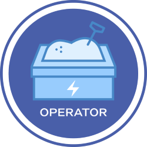

# Plex Sandbox Operator

[](https://goreportcard.com/report/github.com/plexsystems/sandbox-operator)
[](https://github.com/plexsystems/sandbox-operator/releases)



## Introduction

The Plex Sandbox Operator is an operator for [Kubernetes](https://kubernetes.io/) that enables authenticated users to a cluster to create their own isolated environments leveraging namespaces.

## Installation

The [deploy](deploy) folder contains the necessary Kubernetes manifests to install the operator.

## Configuration

The sandbox operator can leverage different clients, depending upon how authenitcation is configured for your cluster.

### Azure

If Azure credentials are provided to the deployment, the operator will perform a lookup of the user in the owners field to fetch that users ObjectID inside of Azure.

This enables users of the operator to provide a user friendly name, such as their email address, and have the operator itself handle the creation of the bindings within Kubernetes.

To use the Azure client, include the following environment variables:

- `AZURE_CLIENT_ID`
- `AZURE_TENANT_ID`
- `AZURE_CLIENT_SECRET`

### Default

If no credentials are provided, the operator will create the bindings using the values listed in the owners field.

## Usage

To use the operator, create and apply a Sandbox CRD to the target cluster.

The following manifest will create a sandbox called `test` (the resulting namespace being `sandbox-test`), and assign the RBAC roles to user `foo@bar.com`

```yaml
apiVersion: operators.plex.dev/v1alpha1
kind: Sandbox
metadata:
  name: test
spec:
  owners:
  - foo@bar.com
```

### Created Resources

For each sandbox that is created the following resources will be created:

- `Namespace`: Name of the sandbox, prefixed with `sandbox-`.

- `ClusterRole`: Only the permission to delete and view the created sandbox.

- `ClusterRoleBinding`: Given to each user listed in the `owners` field of the Sandbox CRD.

- `Role`: Permissions to manage the contents of the sandbox, but no permission to view secrets.

- `RoleBinding`: Given to each user listed in the `owners` field of the Sandbox CRD.

- `ResourceQuota`: Defined quotas for the Sandbox.

## Development

### Testing

### Unit tests

Run the `make test-unit` command. This will use an in-memory kubernetes client to validate and test your changes.

### Integration tests

Run the `make test-integration` command. This will create a Kubernetes cluster for you, using [Kind](https://github.com/kubernetes-sigs/kind), and deploy the operator to it. Afterwards, the integration tests will be ran against the newly created cluster and operator.

**NOTE:** To test the operator with different versions of Kubernetes, you can use the `KUBERNETES_VERSION` variable to when calling `make`. For example, to test on Kubernetes v1.16.3, run the following command:

`make test-integration KUBERNETES_VERSION=v1.16.3`

## Contributing

We :heart: pull requests. If you have a question, feedback, or would like to contribute — please feel free to create an issue or open a pull request!
